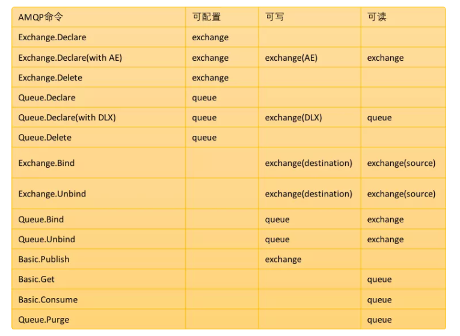

这里涉及到三种不同的权限：

- 读：和消息消费有关的所有操作，包括清除整个队列的消息。
- 写：发布消息。
- 配置：消息队列、交换机等的创建和删除。

下图展示了操作和权限的对应关系：



RabbitMQ 中权限操作命令格式如下：

rabbitmqctl set_permissions [-p vhosts] {user} {conf} {write} {read}

[-p vhost]：授予用户访问权限的 vhost 名称，如果不写默认为 /。
user：用户名。
conf：用户在哪些资源上拥有可配置权限（支持正则表达式）。
write：用户在哪些资源上拥有写权限（支持正则表达式）。
read：用户在哪些资源上拥有读权限（支持正则表达式）。

举例

```shell

# 假设我们有一个名为 zhangsan 的用户，我们希望该用户在 myvh 虚拟主机下具备所有权限，那么我们的操作命令如下：
rabbitmqctl set_permissions -p myvh zhangsan ".*" ".*" ".*"

# 接下来执行如下命令可以验证授权是否成功：

rabbitmqctl -p myvh list_permissions

# 我们可以使用如下命令来移除某一个用户在某一个 vhost 上的权限，例如移除 zhangsan 在 myvh 上的所有权限，如下：
rabbitmqctl clear_permissions -p myvh zhangsan

# 查看 lisi 在所有 vhost 上的权限：
rabbitmqctl list_user_permissions lisi
```
