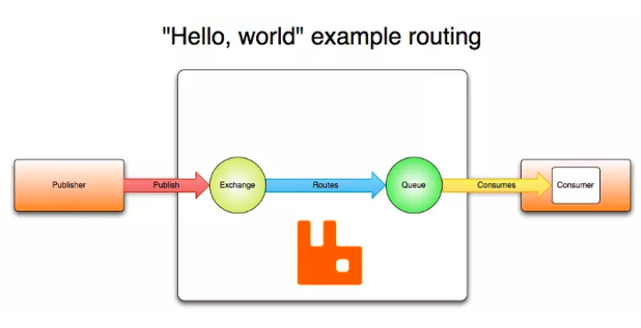

### RabbitMQ 发送可靠性

#### RabbitMQ 消息发送机制

> RabbitMQ 中的消息发送引入了 Exchange（交换机）的概念，消息的发送首先到达交换机上，然后再根据既定的路由规则，由交换机将消息路由到不同的 Queue（队列）中，再由不同的消费者去消费。



所以要确保消息发送的可靠性，主要从两方面去确认：

- 消息成功到达 Exchange
- 消息成功到达 Queue

如果这两步中任一步骤出现问题，那么消息就没有成功送达，此时我们可能要通过重试等方式去重新发送消息，多次重试之后，如果消息还是不能到达，则可能就需要人工介入了

经过上面的分析，我们可以确认，要确保消息成功发送，我们只需要做好三件事就可以了：

- 确认消息到达 Exchange。
- 确认消息到达 Queue。
- 开启定时任务，定时投递那些发送失败的消息。

如何确保消息成功到达 RabbitMQ？RabbitMQ 给出了两种方案：

- 开启事务机制
- 发送方确认机制(手动机制)


#### 事务机制

1. 创建事务管理器

```java
@Bean
RabbitTransactionManager transactionManager(ConnectionFactory connectionFactory) {
    return new RabbitTransactionManager(connectionFactory);
}
```

2. 发送消息的方法上添加 @Transactional 注解标记事务。
3. 调用 rabbitTemplate.setChannelTransacted 方法设置为 true 开启事务模式。

当我们开启事务模式之后，RabbitMQ 生产者发送消息会多出四个步骤：

客户端发出请求，将信道设置为事务模式。
服务端给出回复，同意将信道设置为事务模式。
客户端发送消息。
客户端提交事务。
服务端给出响应，确认事务提交。

上面的步骤，除了第三步是本来就有的，其他几个步骤都是平白无故多出来的。所以大家看到，事务模式其实效率有点低，这并非一个最佳解决方案。我们可以想想，什么项目会用到消息中间件？一般来说都是一些高并发的项目，这个时候并发性能尤为重要。

所以，RabbitMQ 还提供了发送方确认机制（publisher confirm）来确保消息发送成功，这种方式，性能要远远高于事务模式，一起来看下。

如果在项目中要用rabbitmq的事务，也要用数据库的事务，那么可以通过@Transactional注解的transactionManager指定不同的事务管理器

#### 发送方确认机制

> 不能和事务模式并存！否则启动会报错的

配置：


```properties
# 开启发送确认机制,配置消息到达交换器的确认回调
spring.rabbitmq.publisher-confirm-type=correlated
# 消息如果没有成功到达队列，会触发回调方法
spring.rabbitmq.publisher-returns=true
```

第一行属性的配置有三个取值：

none：表示禁用发布确认模式，默认即此。
correlated：表示成功发布消息到交换器后会触发的回调方法。
simple：类似 correlated，并且支持 waitForConfirms() 和 waitForConfirmsOrDie() 方法的调用。

需要实现两个接口：
RabbitTemplate.ConfirmCallback 消息成功到达交换机的回调
RabbitTemplate.ReturnsCallback 消息未成功到达队列的消息

---

### 消息发送的重试机制

#### Spring自带的重试机制

```properties
spring.rabbitmq.template.retry.enabled=true
spring.rabbitmq.template.retry.initial-interval=1000ms
spring.rabbitmq.template.retry.max-attempts=10
spring.rabbitmq.template.retry.max-interval=10000ms
spring.rabbitmq.template.retry.multiplier=2
```
从上往下配置含义依次是：

开启重试机制。
重试起始间隔时间。
最大重试次数。
最大重试间隔时间。
间隔时间乘数。（这里配置间隔时间乘数为 2，则第一次间隔时间 1 秒，第二次重试间隔时间 2 秒，第三次 4 秒，以此类推）

#### 业务重试

> 通过数据库来记录发送消息的记录，并定时重试未成功的消息
