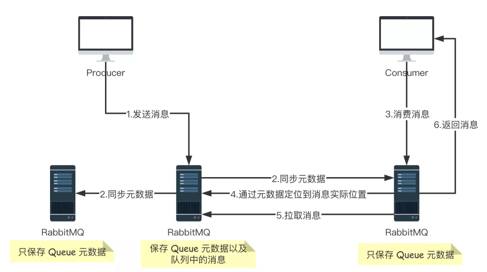
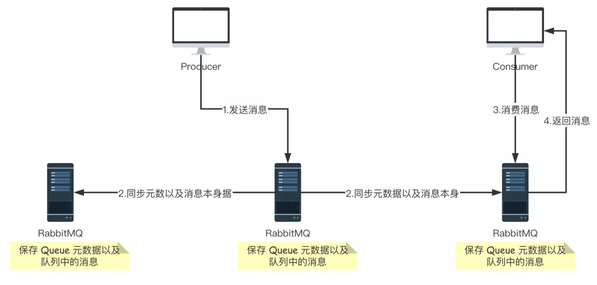

### 集群的两种模式

- 普通集群
- 镜像集群

### 普通集群

普通集群模式，就是将 RabbitMQ 部署到多台服务器上，每个服务器启动一个 RabbitMQ 实例，多个实例之间进行消息通信。
此时我们创建的队列 Queue，它的元数据（主要就是 Queue 的一些配置信息）会在所有的 RabbitMQ 实例中进行同步，但是队列中的消息只会存在于一个 RabbitMQ 实例上，而不会同步到其他队列。
当我们消费消息的时候，如果连接到了另外一个实例，那么那个实例会通过元数据定位到 Queue 所在的位置，然后访问 Queue 所在的实例，拉取数据过来发送给消费者。
这种集群可以提高 RabbitMQ 的消息吞吐能力，但是无法保证高可用，因为一旦一个 RabbitMQ 实例挂了，消息就没法访问了，如果消息队列做了持久化，那么等 RabbitMQ 实例恢复后，就可以继续访问了；如果消息队列没做持久化，那么消息就丢了。
大致的流程图如下图：



### 镜像集群

它和普通集群最大的区别在于 Queue 数据和原数据不再是单独存储在一台机器上，而是同时存储在多台机器上。
也就是说每个 RabbitMQ 实例都有一份镜像数据（副本数据）。
每次写入消息的时候都会自动把数据同步到多台实例上去，这样一旦其中一台机器发生故障，其他机器还有一份副本数据可以继续提供服务，也就实现了高可用。


### 节点类型

RabbitMQ 中的节点类型有两种：

- RAM node
  > 内存节点将所有的队列、交换机、绑定、用户、权限和 vhost 的元数据定义存储在内存中，好处是可以使得交换机和队列声明等操作速度更快。
- Disk node
  > 将元数据存储在磁盘中，单节点系统只允许磁盘类型的节点，防止重启 RabbitMQ 的时候，丢失系统的配置信息

RabbitMQ 要求在集群中至少有一个磁盘节点，所有其他节点可以是内存节点，当节点加入或者离开集群时，必须要将该变更通知到至少一个磁盘节点。
如果集群中唯一的一个磁盘节点崩溃的话，集群仍然可以保持运行，但是无法进行其他操作（增删改查），直到节点恢复。
为了确保集群信息的可靠性，或者在不确定使用磁盘节点还是内存节点的时候，建议直接用磁盘节点。

--- 


### 搭建普通集群

搭建之前，有两个预备知识需要大家了解：

- 搭建集群时，节点中的 Erlang Cookie 值要一致，默认情况下，文件在 /var/lib/rabbitmq/.erlang.cookie，我们在用 docker 创建 RabbitMQ 容器时，可以为之设置相应的 Cookie 值。
- RabbitMQ 是通过主机名来连接服务，必须保证各个主机名之间可以 ping 通。可以通过编辑 /etc/hosts 来手工添加主机名和 IP 对应关系。如果主机名 ping 不通，RabbitMQ 服务启动会失败（如果我们是在不同的服务器上搭建 RabbitMQ 集群，大家需要注意这一点，接下来的 2.2 小结，我们将通过 Docker 的容器连接 link 来实现容器之间的访问，略有不同）。

```shell

docker run -d --hostname rabbit01 --name mq01 -p 5671:5672 -p 15671:15672 -e RABBITMQ_ERLANG_COOKIE="javaboy_rabbitmq_cookie" rabbitmq:3-management
docker run -d --hostname rabbit02 --name mq02 --link mq01:mylink01 -p 5672:5672 -p 15672:15672 -e RABBITMQ_ERLANG_COOKIE="javaboy_rabbitmq_cookie" rabbitmq:3-management
docker run -d --hostname rabbit03 --name mq03 --link mq01:mylink02 --link mq02:mylink03 -p 5673:5672 -p 15673:15672 -e RABBITMQ_ERLANG_COOKIE="javaboy_rabbitmq_cookie" rabbitmq:3-management

```
分别执行如下命令将 mq02 容器加入集群中

```shell

docker exec -it mq02 /bin/bash
rabbitmqctl stop_app
rabbitmqctl join_cluster rabbit@rabbit01
rabbitmqctl start_app

# 查看集群状态

rabbitmqctl cluster_status
```

接下来通过相同的方式将 mq03 也加入到集群中：

```shell
docker exec -it mq03 /bin/bash
rabbitmqctl stop_app
rabbitmqctl join_cluster rabbit@rabbit01
rabbitmqctl start_app

```

此时mq01是主节点，如果mq01挂了，那么其他节点也将不可用

### 搭建镜像集群

所谓的镜像集群模式并不需要额外搭建，只需要我们将队列配置为镜像队列即可。这个配置可以通过网页配置，也可以通过命令行配置

####  网页配置镜像队列

点击 Admin 选项卡，然后点击右边的 Policies，再点击 Add/update a policy

各参数含义如下：

- Name: policy 的名称。
- Pattern: queue 的匹配模式(正则表达式)。
- priority 为可选参数，表示 policy 的优先级。
- Definition：镜像定义，主要有三个参数：ha-mode, ha-params, ha-sync-mode。
- ha-mode：指明镜像队列的模式，有效值为 all、exactly、nodes。其中 all 表示在集群中所有的节点上进行镜像（默认即此）；exactly 表示在指定个数的节点上进行镜像，节点的个数由 ha-params 指定；nodes 表示在指定的节点上进行镜像，节点名称通过 ha-params 指定。
- ha-params：ha-mode 模式需要用到的参数。
- ha-sync-mode：进行队列中消息的同步方式，有效值为 automatic 和 manual。

